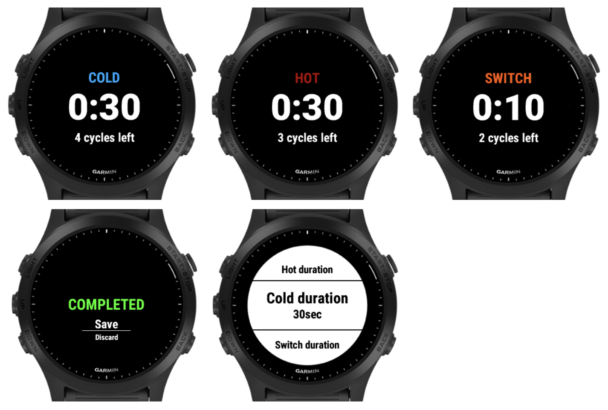

# Garmin Contrast Shower watch application

An application for Garmin watches to take a contrast shower  
https://apps.garmin.com/en-US/apps/9499ec2c-d424-4135-a62d-130956bc1a6f

# Version History

1.5.1 - Add support of new devices  
1.5.0 - Add Double Click option  
1.4.5 - Add support of new watches  
1.4.4 - Add support of Forerunner 255s/255s Music  
1.4.3 - Add support of Forerunner 255/255 Music  
1.4.2 - Add separate Completed screen to be compatible with Instinct devices  
1.4.1 - Increase max cycle duration from 99 to 999 seconds  
1.4.0 - Add Save/Discard actions after activity completed  
1.3.2 - Do not save record if user exits during activity  
1.3.1 - Remove unsupported products  
1.3.0 - Add Switch cycle when water changes  
1.2.3 - Fix missing labels on Instinct devices  
1.2.2 - Fix layout on Instinct devices  
1.2.1 - Make vibration back stronger  
1.2.0 - Shorten vibration between cycles  
1.1.0 - Added completed view  
**1.0.2 - Initial public version**  
0.4.0 - Added possibility to disable activity recording  
0.3.0 - Now an activity is recording  
0.2.0 - Added possibility to edit configurations  
0.1.1 - Moved cycles and view operations to the separate managers  
0.1.0 - Initial mvp version

# Future enhancements

High priority:
- Add the possibility to set a single cycle and use only COLD type for Cold Shower
- Add the possibility to select the activity type
- Fix touchsceen issue
- Configure first cycle type

Low priority:
- Possibility to manually control cycles by Lap button
- Possibility to save activity in the middle
- User predefined and editable presets
- Smart plans (e.g. if whole week without missing, switch to the second cycles regime)
- Refactor code

# Local set up

Use Visual Studio Code and Monkey C plugin

Side Loading an App:

1. Use Ctrl + Shift + P (Command + Shift + P on the Mac) to summon the command palette
2. In the command palette type “Build for Device” and select Monkey C: Build for Device
3. Select the product you wish to build for
4. Copy the generated PRG files to your device’s GARMIN/APPS directory
